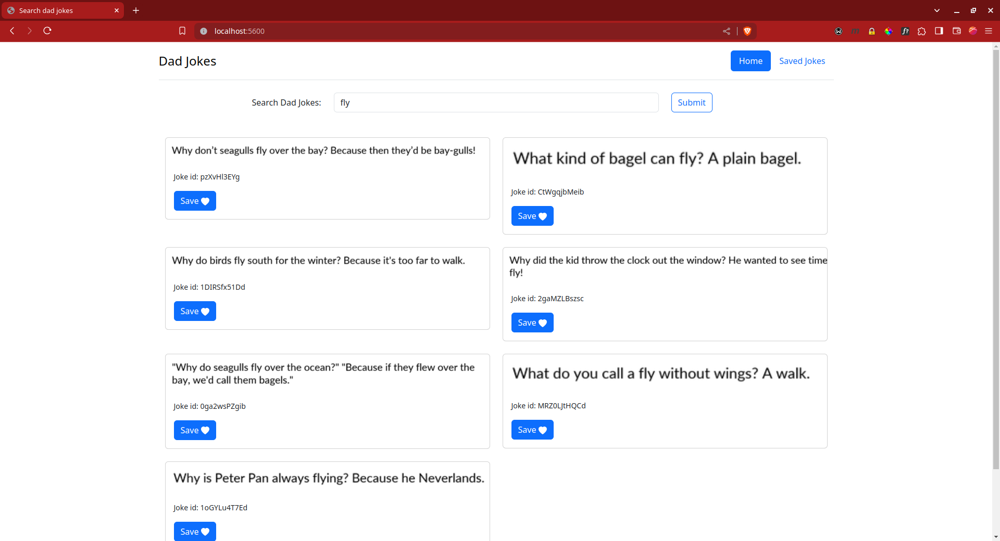
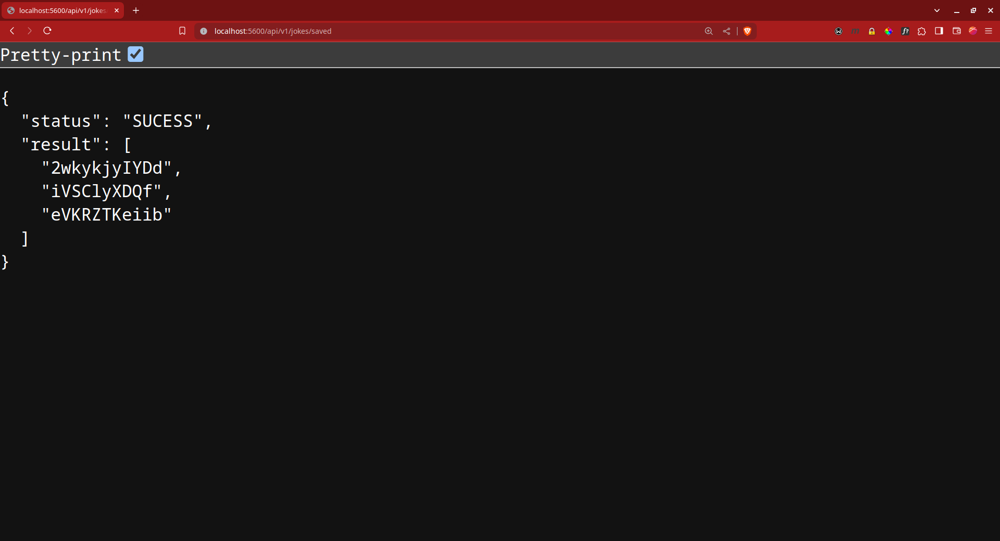

# Dad Jokes App

Dad Jokes app using express

## Instructions

1. Make a copy of `.env.sample` as `.env`, uncomment and update database and server port env variables.
2. Install Dependencies using `npm install`
3. Create a new database in postgres and create a `jokes` table. Refer `db.sql` file.
   - Ensure database name matches the `DB_NAME` env variable.
4. Run the express server using `nodemon` or directly using `node index.js`

### Endpoints

1. Frontend - `localhost:<PORT>`

   - GET `/` - Home page (Joke Search Page)
   - GET `/saved.html` - Saved Jokes (Favourite Jokes)

2. Backend (API) - `localhost:<PORT>/api/v1/jokes`

   - GET `/search?term=<query>` - Search jokes with <query> term
   - GET `/saved` - Get saved jokes.
   - POST `/saved` - Save a new joke.
     - body: { "joke_id": <joke_id>}
     - Accept: application/json
   - DELETE `/saved/:joke_id` - Delete saved joke with joke_id

#### Example:

```
http://localhost:5600/
```



```
http://localhost:5600/api/v1/jokes/saved
```


